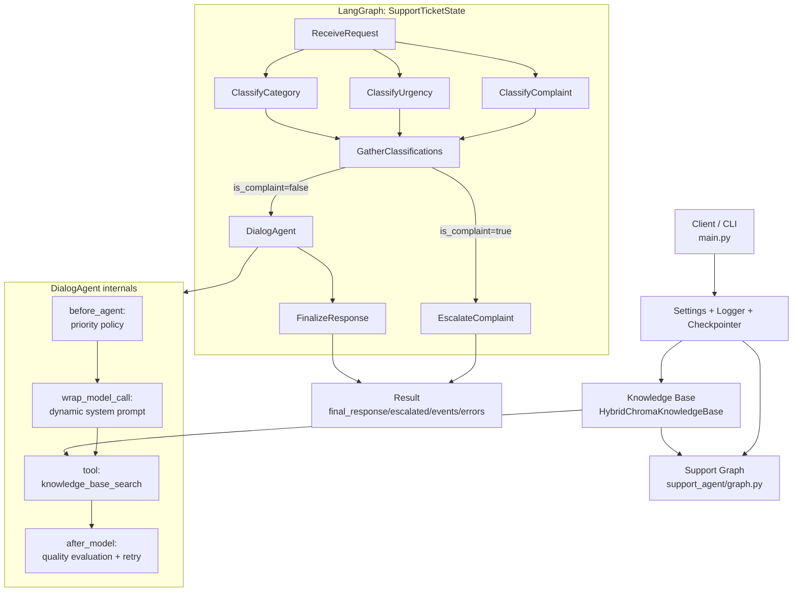
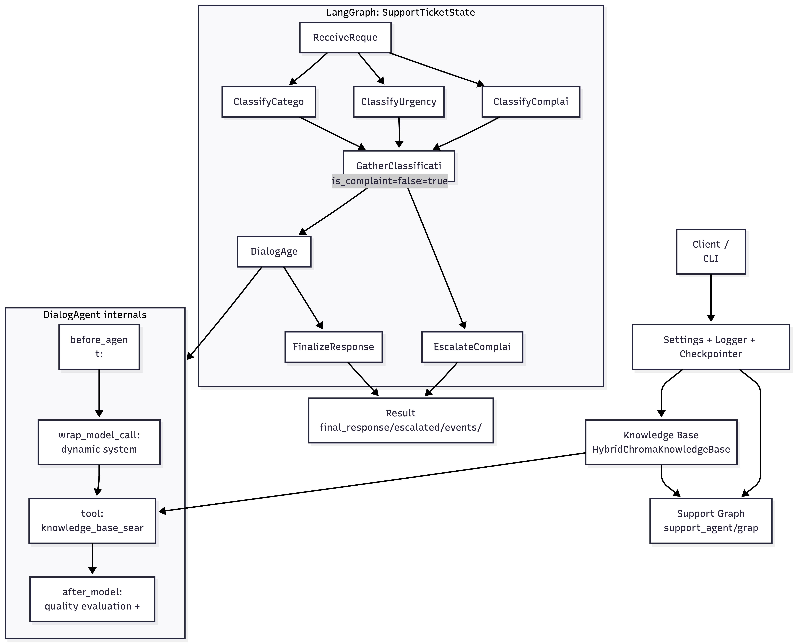

# Архитектура Support Agent

## Архитектурная диаграмма

## Описание

### 1. Точка входа
- `main.py` поднимает настройки (`Settings`), логирование, чекпоинтер (`MemorySaver`) и базу знаний.
- Затем собирается граф через `build_support_graph(...)` и выполняется `app.invoke(...)`.

### 2. Состояние графа
- Единое состояние: `SupportTicketState` (`support_agent/state.py`).
- В состоянии хранятся: текст запроса, классификация, найденные документы, метрики качества ответа, флаги эскалации, события и ошибки.

### 3. Основной pipeline (graph.py)
- `ReceiveRequest` — нормализует входные поля и значения по умолчанию.
- Параллельная классификация:
  - `ClassifyComplaint`
  - `ClassifyUrgency`
  - `ClassifyCategory`
- `GatherClassifications` — объединяет результаты.
- Роутинг:
  - жалоба (`is_complaint=true`) -> `EscalateComplaint`
  - иначе -> `DialogAgent`
- `FinalizeResponse` — формирует финальный текст ответа.

### 4. DialogAgent
- Построен через `create_agent(...)` с middleware.
- Использует tool `knowledge_base_search`, который обращается к `HybridChromaKnowledgeBase.search(...)`.
- Middleware:
  - `before_agent`: добавляет приоритетную инструкцию для срочных кейсов;
  - `wrap_model_call`: внедряет динамический system prompt (по категории/приоритету);
  - `after_model`: оценивает качество ответа, при необходимости делает retry.

### 5. База знаний
- `HybridChromaKnowledgeBase` совмещает dense retrieval (Chroma + embeddings) и sparse retrieval (BM25) через `EnsembleRetriever`.
- Возвращает top-k релевантных `Document`.

### 6. Промпты
- Все ключевые промпты и строковые инструкции вынесены в `support_agent/prompts.py`.
- `graph.py` импортирует именованные константы/билдеры промптов.

### 7. Наблюдаемость
- Логирование добавлено на уровне каждой ноды в `graph.py`.
- В состоянии копятся `events`/`errors` через `make_event` и `make_error`.

