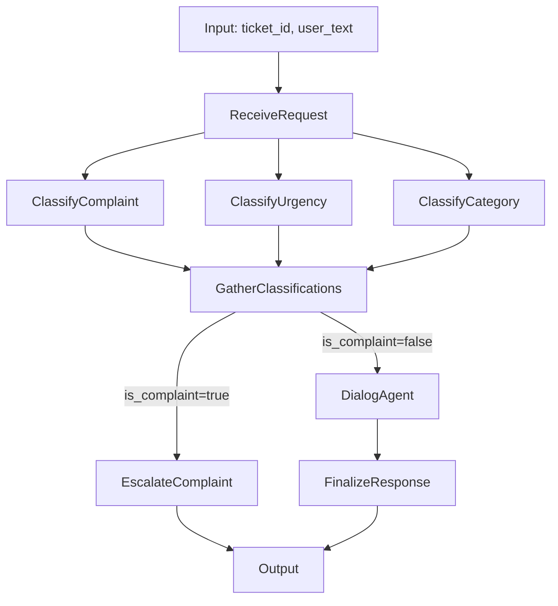

# Smart Support Agent (LangGraph + LLM)

Проект демонстрирует PoC мультиагентной обработки обращений в техподдержку.

Агент:
- принимает `ticket_id` и `user_text`;
- классифицирует обращение (жалоба/категория/срочность);
- для жалоб сразу делает эскалацию;
- для обычных запросов использует поиск по базе знаний;
- генерирует ответ и проверяет его качество;
- при низком качестве делает ограниченное число retry.

## Где посмотреть запуск

Примеры запуска и поток выполнения по шагам находятся в ноутбуке:
- `/Users/zheka/Documents/ML/agents/ccz_test/test_dialog.ipynb`

## Быстрый старт

### 1. Установка зависимостей

```bash
uv sync
```

### 2. Настройка окружения

Создайте `.env` на основе `.env.example` и заполните ключи (минимум GigaChat credentials).

### 3. Запуск одного запроса

```bash
uv run python main.py --ticket-id TICKET-LOCAL-001 --text "Как восстановить пароль?"
```

### 4. Batch-прогон тестовых кейсов

```bash
uv run python main.py --batch
```

## Формат результата

Пример ответа:

```json
{
  "final_response": "...",
  "escalated": false,
  "escalation_reason": null,
  "events": [],

}
```

## Архитектура

Точка входа: `main.py` -> `support_agent/graph.py`.
Подробно в [ARCHITECTURE.md](ARCHITECTURE.md)



### DialogAgent внутри

- `before_agent`: добавляет приоритетную инструкцию для срочных обращений;
- `wrap_model_call`: добавляет динамический prompt по категории/приоритету;
- `tool`: `knowledge_base_search` (поиск в KB);
- `after_model`: оценка качества + retry при необходимости.

## База знаний

Используется `HybridChromaKnowledgeBase`:
- dense retrieval (Chroma + embeddings),
- sparse retrieval (BM25),
- объединение через `EnsembleRetriever`.

Датасет:
- `dataset/dataset.json` — тестовые кейсы;
- `dataset/*.md` — источник для KB.

## Логирование и трассировка

- Логи по нодам в `support_agent/graph.py`.
- События/ошибки пишутся в state (`events`, `errors`).
- Утилиты форматирования потоков/сообщений: `support_agent/utils.py`.

## Структура проекта

- `main.py` — CLI запуск.
- `support_agent/graph.py` — основной рабочий граф.
- `support_agent/prompts.py` — все ключевые промпты.
- `support_agent/state.py` — схема состояния графа.
- `support_agent/knowledge_base.py` — retrieval-слой.
- `support_agent/logging_utils.py` — генерация событий/ошибок.
- `tests/test_dataset_json.py` — проверка консистентности датасета.
- `support_agent/config.py` — настройки, берутся из .env.

## Тесты

Проверка датасета:

```bash
uv run python -m unittest tests/test_dataset_json.py -v
```

## Важно

В текущем активном рантайме используется `support_agent/graph.py`.

## Примеры трейсов
[жалоба](https://smith.langchain.com/public/e777245d-d64d-41d7-ab12-19522a86da78/r)

[простой вопрос](https://smith.langchain.com/public/e777245d-d64d-41d7-ab12-19522a86da78/r)
