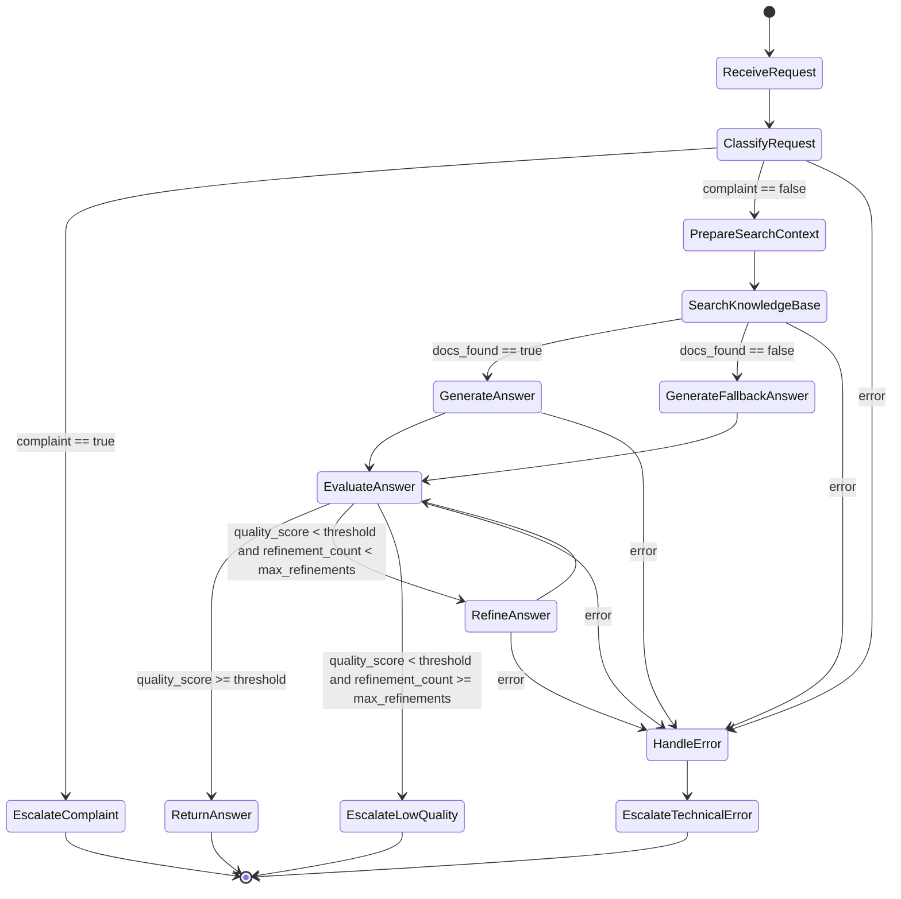

# Мультиагентная система обработки обращений в техподдержку

## 1. Назначение проекта

Проект предназначен для проектирования и проверки proof-of-concept решения, которое автоматически обрабатывает пользовательские обращения в техническую поддержку с помощью LLM-агентов и графа состояний LangGraph.

Система принимает текст обращения и идентификатор тикета, классифицирует обращение, эскалирует жалобы оператору, для остальных запросов ищет информацию во внутренней базе знаний, генерирует ответ, оценивает его качество и при необходимости дорабатывает.

## 2. Цели и ожидаемый результат

Цель PoC - подтвердить архитектурные решения для мультиагентной обработки обращений:

- маршрутизация обращений через LangGraph;
- разделение логики на независимые узлы-агенты;
- немедленная эскалация жалоб;
- интеграция с базой знаний через retrieval-слой;
- генерация ответа LLM на основе найденного контекста;
- автоматическая оценка ответа по критериям полноты, вежливости и релевантности;
- цикл доработки ответа при недостаточном качестве;
- централизованное логирование переходов, оценок и ошибок.

Ожидаемый результат работы системы:

```json
{
  "final_response": "Строка с итоговым ответом пользователю или сообщением об эскалации",
  "escalated": false,
  "escalation_reason": null
}
```

## 3. Бизнес-требования

### 3.1. Входные данные

Система получает:

- `ticket_id` - уникальный идентификатор обращения или сессии;
- `user_text` - исходный текст обращения пользователя.

### 3.2. Выходные данные

Система возвращает:

- `final_response` - итоговый текст ответа;
- `escalated` - флаг эскалации обращения оператору;
- `escalation_reason` - причина эскалации, если она произошла.

### 3.3. Основные сценарии

1. Пользователь отправляет жалобу.
2. Система классифицирует обращение как жалобу.
3. Обращение немедленно эскалируется оператору.
4. Пользователь получает сообщение о передаче обращения специалисту.

---

1. Пользователь отправляет информационный или технический вопрос.
2. Система классифицирует обращение как не жалобу.
3. Система ищет релевантные материалы во внутренней базе знаний.
4. LLM генерирует ответ на основе найденного контекста.
5. Ответ оценивается по полноте, вежливости и релевантности.
6. Если оценка выше порога, ответ возвращается пользователю.
7. Если оценка ниже порога, ответ отправляется на доработку.
8. После ограниченного числа доработок система либо возвращает улучшенный ответ, либо эскалирует обращение оператору.

## 4. Архитектура решения

### 4.1. Архитектурный подход

Решение строится как граф состояний LangGraph. Каждый узел графа отвечает за одну бизнес-функцию и получает на вход общее состояние обращения. Узлы не вызывают друг друга напрямую: управление передается через ребра графа и условные переходы.

Такой подход выбран потому, что он:

- явно описывает жизненный цикл обращения;
- упрощает добавление новых проверок и агентов;
- позволяет реализовать циклы доработки;
- делает трассировку решений прозрачной;
- хорошо подходит для логирования и воспроизведения ошибок.

### 4.2. Диаграмма состояний



### 4.3. Логические узлы

#### `ReceiveRequest`

Отвечает за первичную инициализацию состояния.

Функции:

- принимает `ticket_id` и `user_text`;
- создает начальное состояние;
- добавляет служебные поля;
- фиксирует событие `request_received` в логах.

#### `ClassifyRequest`

Классифицирует обращение.

Функции:

- определяет, является ли обращение жалобой;
- выделяет тип обращения: `complaint`, `technical_question`, `billing_question`, `how_to`, `other`;
- может извлекать базовые признаки: тональность, срочность, продукт, тему;
- записывает результат классификации в состояние;
- при жалобе направляет обращение на эскалацию.

Пример жалобы:

> "Уже третий день не работает сервис, поддержка не отвечает, требую разобраться."

Пример не жалобы:

> "Как восстановить пароль от личного кабинета?"

#### `EscalateComplaint`

Немедленно завершает автоматическую обработку жалобы.

Функции:

- устанавливает `escalated = true`;
- заполняет `escalation_reason = "complaint_detected"`;
- формирует нейтральный ответ пользователю;
- логирует событие эскалации.

#### `PrepareSearchContext`

Готовит параметры поиска в базе знаний.

Функции:

- формирует поисковый запрос из исходного обращения;
- определяет домен поиска: аккаунт, платежи, технические ошибки, инструкции;
- задает список сущностей, которые нужно учитывать при поиске;
- подготавливает динамические параметры для retrieval-слоя.

#### `SearchKnowledgeBase`

Ищет релевантные документы во внутренней базе знаний.

Функции:

- вызывает интерфейс базы знаний;
- получает список документов или фрагментов;
- сохраняет найденный контекст в `retrieved_docs`;
- фиксирует количество найденных документов и ошибки поиска.

В PoC база знаний может быть реализована заглушкой: словарь, список документов, CSV или простая функция поиска по ключевым словам. В промышленной версии слой заменяется на RAG-компонент: embeddings, vector store, hybrid search, reranker.

#### `GenerateAnswer`

Генерирует ответ пользователю на основе найденного контекста.

Функции:

- получает `user_text`, классификацию и `retrieved_docs`;
- формирует prompt из статических инструкций и динамических параметров;
- вызывает LLM-провайдера;
- сохраняет черновик ответа в `draft_response`;
- логирует факт генерации.

#### `GenerateFallbackAnswer`

Формирует осторожный ответ, если релевантные документы не найдены.

Функции:

- не выдумывает факты;
- сообщает, что информации недостаточно;
- при необходимости предлагает уточнить детали;
- передает ответ на оценку качества.

#### `EvaluateAnswer`

Оценивает качество ответа.

Функции:

- проверяет полноту;
- проверяет вежливость;
- проверяет релевантность;
- возвращает оценки от 0 до 1;
- рассчитывает агрегированный `quality_score`;
- сохраняет объяснение оценки в `evaluation_notes`.

Рекомендуемая формула для PoC:

```text
quality_score = 0.4 * completeness + 0.2 * politeness + 0.4 * relevance
```

Порог качества по умолчанию:

```text
quality_threshold = 0.75
```

#### `RefineAnswer`

Дорабатывает ответ при низком качестве.

Функции:

- принимает текущий ответ и результаты оценки;
- формирует prompt с замечаниями оценщика;
- улучшает ответ;
- увеличивает `refinement_count`;
- отправляет результат на повторную оценку.

#### `ReturnAnswer`

Завершает успешный сценарий.

Функции:

- переносит лучший ответ в `final_response`;
- устанавливает `escalated = false`;
- логирует успешное завершение.

#### `EscalateLowQuality`

Эскалирует обращение, если система не смогла получить качественный ответ.

Функции:

- устанавливает `escalated = true`;
- заполняет `escalation_reason = "low_quality_answer"`;
- формирует сообщение о передаче обращения специалисту;
- логирует причину эскалации.

#### `HandleError`

Централизованно обрабатывает технические ошибки.

Функции:

- сохраняет тип ошибки и сообщение;
- фиксирует узел, в котором произошла ошибка;
- пишет событие в лог;
- передает обращение на техническую эскалацию.

#### `EscalateTechnicalError`

Завершает обработку при технической ошибке.

Функции:

- устанавливает `escalated = true`;
- заполняет `escalation_reason = "technical_error"`;
- возвращает пользователю безопасное сообщение;
- сохраняет диагностическую информацию в логах.

## 5. Модель состояния LangGraph

Состояние должно быть типизировано через `TypedDict` или `pydantic`-модель.

Минимальная модель для PoC:

```python
from typing import Any, Literal, TypedDict


class SupportTicketState(TypedDict, total=False):
    ticket_id: str
    user_text: str

    category: Literal[
        "complaint",
        "technical_question",
        "billing_question",
        "how_to",
        "other",
    ]
    is_complaint: bool
    urgency: Literal["low", "medium", "high"]
    sentiment: Literal["negative", "neutral", "positive"]

    search_query: str
    search_filters: dict[str, Any]
    extracted_entities: dict[str, Any]
    retrieved_docs: list[dict[str, Any]]

    draft_response: str
    final_response: str

    completeness: float
    politeness: float
    relevance: float
    quality_score: float
    evaluation_notes: str
    quality_threshold: float

    refinement_count: int
    max_refinements: int

    escalated: bool
    escalation_reason: str | None

    current_node: str
    errors: list[dict[str, Any]]
    events: list[dict[str, Any]]
```

## 6. Поток управления

### 6.1. Основной поток

1. `ReceiveRequest` создает состояние обращения.
2. `ClassifyRequest` определяет тип обращения.
3. Если обращение является жалобой, выполняется `EscalateComplaint`.
4. Если это не жалоба, выполняется `PrepareSearchContext`.
5. `SearchKnowledgeBase` ищет релевантные материалы.
6. Если документы найдены, выполняется `GenerateAnswer`.
7. Если документы не найдены, выполняется `GenerateFallbackAnswer`.
8. `EvaluateAnswer` оценивает ответ.
9. Если оценка достаточная, выполняется `ReturnAnswer`.
10. Если оценка низкая и лимит доработок не исчерпан, выполняется `RefineAnswer`.
11. Если лимит доработок исчерпан, выполняется `EscalateLowQuality`.

### 6.2. Условные переходы

Ключевые условия:

```text
is_complaint == true -> EscalateComplaint
is_complaint == false -> PrepareSearchContext
len(retrieved_docs) > 0 -> GenerateAnswer
len(retrieved_docs) == 0 -> GenerateFallbackAnswer
quality_score >= quality_threshold -> ReturnAnswer
quality_score < quality_threshold and refinement_count < max_refinements -> RefineAnswer
quality_score < quality_threshold and refinement_count >= max_refinements -> EscalateLowQuality
```

### 6.3. Обработка ошибок

Любой узел, который обращается к внешним системам, должен перехватывать исключения и добавлять запись в `errors`.

Рекомендуемый формат ошибки:

```json
{
  "ticket_id": "TICKET-001",
  "node": "GenerateAnswer",
  "error_type": "LLMProviderError",
  "message": "Timeout while calling LLM provider",
  "timestamp": "2026-05-26T12:00:00+03:00"
}
```

После критической ошибки обращение должно быть эскалировано с причиной `technical_error`.

## 7. Интеграция с базой знаний

### 7.1. Интерфейс

Для отделения графа от конкретной реализации базы знаний вводится интерфейс:

```python
class KnowledgeBase:
    def search(
        self,
        query: str,
        filters: dict[str, object] | None = None,
        top_k: int = 3,
    ) -> list[dict[str, object]]:
        ...
```

### 7.2. Реализация для PoC

В PoC можно использовать:

- список словарей в коде;
- CSV-файл;
- простой keyword search;
- имитацию релевантности через совпадение терминов.
- гибридный поиск: Chroma (vector similarity) + lexical reranking.

В текущем PoC тестовые источники хранятся в:

- `dataset/kb_doc_1.md`
- `dataset/kb_doc_2.md`
- `dataset/kb_doc_3.md`

Пример документа:

```json
{
  "id": "kb-password-reset",
  "title": "Восстановление пароля",
  "content": "Для восстановления пароля откройте страницу входа и нажмите 'Забыли пароль'.",
  "tags": ["account", "password", "login"]
}
```

### 7.3. Целевая реализация

В промышленном варианте слой базы знаний может быть заменен на:

- векторное хранилище;
- гибридный поиск BM25 + embeddings;
- reranker;
- ACL-фильтрацию документов;
- версионирование базы знаний;
- хранение источников, чтобы ответ содержал ссылки на документы.

## 8. Интеграция с LLM-провайдером

### 8.1. Требования к провайдеру

LLM-провайдер должен использоваться через адаптер, чтобы не привязывать граф к конкретной модели.

Поддерживаемые варианты:

- GigaChat через `langchain-gigachat`;
- DeepSeek через `langchain-deepseek`;
- другой LangChain-compatible chat model.

### 8.2. Интерфейс адаптера

```python
class LLMClient:
    def invoke_json(self, system_prompt: str, user_prompt: str) -> dict:
        ...

    def invoke_text(self, system_prompt: str, user_prompt: str) -> str:
        ...
```

### 8.3. Конфигурация

Рекомендуемые переменные окружения:

```text
LLM_PROVIDER=gigachat
GIGACHAT_CREDENTIALS=...
GIGACHAT_SCOPE=GIGACHAT_API_PERS
QUALITY_THRESHOLD=0.75
MAX_REFINEMENTS=2
```

Для локального воспроизведения PoC допускается fallback-режим без реального LLM: deterministic mock, который возвращает заранее заданные ответы. Это полезно для тестов графа и демонстрации логики маршрутизации.

## 9. Динамическое формирование промптов

### 9.1. Принцип

Промпты должны состоять из двух частей:

- стабильная системная инструкция;
- динамический блок параметров, сформированный на основе состояния графа.

Стабильная часть задает роль, ограничения и формат ответа. Динамическая часть меняется в зависимости от классификации, найденных документов, извлеченных сущностей, домена обращения и результатов предыдущей оценки.

### 9.2. Пример структуры

```text
SYSTEM:
Ты агент технической поддержки. Отвечай вежливо, точно и только на основе доступного контекста.
Если данных недостаточно, не выдумывай факты.

DYNAMIC CONTEXT:
- Категория обращения: {category}
- Домен поиска: {search_filters.domain}
- Извлеченные сущности: {extracted_entities}
- Найденные документы: {retrieved_docs}
- Требования к ответу: {answer_requirements}
```

### 9.3. Адаптация на разных этапах

На этапе классификации:

- базовая инструкция неизменна;
- список категорий может расширяться конфигурацией;
- можно добавить перечень сущностей, которые нужно извлечь.

На этапе поиска:

- поисковый запрос строится из `user_text`;
- фильтры зависят от категории и извлеченных сущностей;
- если найдено мало документов, запрос может быть расширен синонимами.

На этапе генерации:

- системные правила неизменны;
- контекст ответа формируется из найденных документов;
- требования к стилю зависят от тональности и срочности обращения.

На этапе доработки:

- базовая инструкция сохраняется;
- в prompt добавляются `evaluation_notes`;
- модель получает конкретные указания: что дополнить, что сократить, где повысить релевантность.

### 9.4. Пример динамического prompt-builder

```python
def build_answer_prompt(state: SupportTicketState) -> tuple[str, str]:
    system_prompt = (
        "Ты агент технической поддержки. Отвечай вежливо, кратко и точно. "
        "Используй только предоставленный контекст. Если данных недостаточно, скажи об этом."
    )

    docs = "\n\n".join(
        f"[{doc['id']}] {doc['title']}\n{doc['content']}"
        for doc in state.get("retrieved_docs", [])
    )

    user_prompt = f"""
    Обращение пользователя:
    {state["user_text"]}

    Категория:
    {state.get("category")}

    Извлеченные сущности:
    {state.get("extracted_entities", {})}

    Контекст базы знаний:
    {docs}

    Сформируй ответ пользователю.
    """

    return system_prompt, user_prompt
```

## 10. Логирование и наблюдаемость

### 10.1. Что логировать

Обязательно логируются:

- получение обращения;
- вход и выход каждого узла;
- классификация обращения;
- факт эскалации;
- поисковый запрос и количество найденных документов;
- факт генерации ответа;
- оценки качества;
- попытки доработки;
- финальное состояние;
- ошибки.

### 10.2. Формат события

```json
{
  "timestamp": "2026-05-26T12:00:00+03:00",
  "ticket_id": "TICKET-001",
  "node": "EvaluateAnswer",
  "event": "quality_evaluated",
  "payload": {
    "completeness": 0.8,
    "politeness": 1.0,
    "relevance": 0.9,
    "quality_score": 0.88
  }
}
```

### 10.3. Для PoC

Для прототипа достаточно:

- стандартного модуля `logging`;
- структурированных JSON-like сообщений;
- вывода в консоль;
- опционально сохранения в файл `logs/support_agent.log`.

В промышленной версии логи можно отправлять в OpenTelemetry, ELK, Grafana Loki или другую систему наблюдаемости.

## 11. Детальное техническое задание

### 11.1. Функциональные требования

#### FR-1. Прием обращения

Система должна принимать `ticket_id` и `user_text`.

Критерии приемки:

- при пустом `ticket_id` система возвращает ошибку валидации;
- при пустом `user_text` система возвращает ошибку валидации;
- валидное обращение передается в граф обработки.

#### FR-2. Классификация обращения

Система должна классифицировать обращение и определить, является ли оно жалобой.

Критерии приемки:

- жалобы получают `is_complaint = true`;
- не жалобы получают `is_complaint = false`;
- результат классификации сохраняется в состоянии;
- событие классификации записывается в лог.

#### FR-3. Эскалация жалоб

Система должна немедленно эскалировать жалобы.

Критерии приемки:

- для жалобы не выполняется поиск в базе знаний;
- `escalated = true`;
- `escalation_reason = "complaint_detected"`;
- `final_response` содержит сообщение о передаче обращения оператору.

#### FR-4. Поиск в базе знаний

Система должна искать релевантную информацию по обращениям, которые не являются жалобами.

Критерии приемки:

- поисковый запрос формируется на основе текста обращения;
- результаты поиска сохраняются в `retrieved_docs`;
- количество найденных документов логируется;
- при отсутствии документов система не выдумывает факты.

#### FR-5. Генерация ответа

Система должна генерировать ответ на основе найденных документов.

Критерии приемки:

- ответ учитывает исходный вопрос пользователя;
- ответ использует найденный контекст;
- ответ сохраняется в `draft_response`;
- генерация логируется.

#### FR-6. Оценка качества ответа

Система должна оценивать ответ по трем критериям:

- полнота;
- вежливость;
- релевантность.

Критерии приемки:

- каждая оценка находится в диапазоне от 0 до 1;
- итоговый `quality_score` находится в диапазоне от 0 до 1;
- результат оценки сохраняется в состоянии;
- оценка логируется.

#### FR-7. Доработка ответа

Система должна дорабатывать ответ, если его качество ниже порога.

Критерии приемки:

- при `quality_score < quality_threshold` запускается `RefineAnswer`;
- количество доработок ограничено `max_refinements`;
- после каждой доработки выполняется повторная оценка;
- попытки доработки логируются.

#### FR-8. Эскалация при низком качестве

Система должна эскалировать обращение, если после допустимого числа доработок ответ остается недостаточно качественным.

Критерии приемки:

- `escalated = true`;
- `escalation_reason = "low_quality_answer"`;
- пользователь получает безопасное сообщение о передаче специалисту.

#### FR-9. Обработка ошибок

Система должна обрабатывать ошибки внешних сервисов и узлов графа.

Критерии приемки:

- ошибка сохраняется в `errors`;
- ошибка логируется с `ticket_id`;
- критическая ошибка приводит к эскалации с причиной `technical_error`.

#### FR-10. Динамические промпты

Система должна поддерживать динамическое формирование промптов.

Критерии приемки:

- системные инструкции вынесены в стабильные шаблоны;
- динамические параметры берутся из состояния;
- список извлекаемых сущностей и поисковый контекст могут меняться на основе предыдущих шагов;
- prompt-builder покрыт отдельными функциями.

### 11.2. Нефункциональные требования

#### NFR-1. Расширяемость

Архитектура должна позволять добавлять новые категории обращений, новые узлы проверки и новых LLM-провайдеров без переписывания всего графа.

#### NFR-2. Наблюдаемость

Каждое обращение должно иметь трассируемую историю обработки по `ticket_id`.

#### NFR-3. Надежность

Система не должна возвращать выдуманный ответ при отсутствии контекста. В сомнительных случаях она должна либо уточнять информацию, либо эскалировать обращение.

#### NFR-4. Тестируемость

PoC должен поддерживать запуск без реального LLM через mock-режим, чтобы можно было проверить маршрутизацию графа и бизнес-логику.

#### NFR-5. Конфигурируемость

Порог качества, количество доработок, провайдер LLM и параметры базы знаний должны задаваться через конфигурацию или переменные окружения.

## 12. План выполнения

### Этап 1. Подготовка проекта

Задачи:

- проверить зависимости `langgraph`, `langchain`, LLM-провайдера;
- определить формат запуска PoC;
- подготовить `.env.example`;
- создать структуру модулей.

Ожидаемый результат:

- проект запускается локально;
- зависимости устанавливаются через `uv` или `pip`;
- есть базовая конфигурация.

### Этап 2. Описание состояния и инфраструктуры

Задачи:

- реализовать `SupportTicketState`;
- добавить конфигурацию `Settings`;
- реализовать структурированное логирование;
- добавить helper для записи событий в состояние.

Ожидаемый результат:

- состояние типизировано;
- события обработки сохраняются и выводятся в лог.

### Этап 3. Реализация базы знаний

Задачи:

- создать mock knowledge base;
- наполнить ее тестовыми документами;
- реализовать метод `search`;
- добавить тестовые обращения.

Ожидаемый результат:

- по типовым вопросам возвращаются релевантные документы;
- при отсутствии совпадений возвращается пустой список.

### Этап 4. Реализация LLM-адаптера

Задачи:

- реализовать интерфейс LLM-клиента;
- добавить адаптер для GigaChat или другого доступного провайдера;
- добавить mock-адаптер для воспроизводимых тестов;
- реализовать вызовы `invoke_text` и `invoke_json`.

Ожидаемый результат:

- граф может работать как с реальным LLM, так и в mock-режиме.

### Этап 5. Реализация узлов графа

Задачи:

- реализовать `classify_request`;
- реализовать `escalate_complaint`;
- реализовать `prepare_search_context`;
- реализовать `search_knowledge_base`;
- реализовать `generate_answer`;
- реализовать `generate_fallback_answer`;
- реализовать `evaluate_answer`;
- реализовать `refine_answer`;
- реализовать `return_answer`;
- реализовать обработчики эскалации и ошибок.

Ожидаемый результат:

- каждый узел можно протестировать отдельно;
- каждый узел пишет события в лог.

### Этап 6. Сборка LangGraph

Задачи:

- создать `StateGraph`;
- добавить узлы;
- описать условные переходы;
- задать entrypoint;
- скомпилировать граф;
- реализовать CLI-запуск.

Ожидаемый результат:

- обращение проходит через граф от входа до финального результата;
- жалобы эскалируются;
- обычные вопросы получают ответ.

### Этап 7. Тестовые сценарии

Задачи:

- подготовить минимум 5 тестовых обращений;
- покрыть сценарий жалобы;
- покрыть успешный FAQ-сценарий;
- покрыть отсутствие документов;
- покрыть низкую оценку и доработку;
- покрыть техническую ошибку через mock.

Ожидаемый результат:

- есть воспроизводимые примеры работы;
- результаты можно приложить к README.

### Этап 8. Документация и демонстрация

Задачи:

- обновить README;
- добавить инструкцию запуска;
- описать архитектурные решения;
- привести примеры входа и выхода;
- описать ограничения PoC и дальнейшие улучшения.

Ожидаемый результат:

- проект можно проверить локально;
- архитектура и логика понятны без чтения всего кода.

## 13. Рекомендуемая структура проекта

```text
.
├── README.md
├── pyproject.toml
├── .env.example
├── main.py
├── support_agent/
│   ├── __init__.py
│   ├── config.py
│   ├── graph.py
│   ├── state.py
│   ├── logging_utils.py
│   ├── prompts.py
│   ├── knowledge_base.py
│   ├── llm.py
│   └── nodes/
│       ├── __init__.py
│       ├── classify.py
│       ├── escalation.py
│       ├── retrieval.py
│       ├── generation.py
│       ├── evaluation.py
│       └── errors.py
└── tests/
    ├── test_graph_routes.py
    ├── test_knowledge_base.py
    └── test_prompt_builders.py
```

## 14. Минимальные тестовые данные

```python
TEST_CASES = [
    {
        "ticket_id": "TICKET-001",
        "user_text": "Не могу войти в личный кабинет, забыл пароль.",
        "expected": "answer",
    },
    {
        "ticket_id": "TICKET-002",
        "user_text": "Уже неделю не работает сервис, я возмущен качеством поддержки.",
        "expected": "complaint_escalation",
    },
    {
        "ticket_id": "TICKET-003",
        "user_text": "Как изменить способ оплаты?",
        "expected": "answer",
    },
    {
        "ticket_id": "TICKET-004",
        "user_text": "Расскажите про интеграцию с неизвестной системой X-42.",
        "expected": "fallback_or_escalation",
    },
    {
        "ticket_id": "TICKET-005",
        "user_text": "Ошибка 500 при загрузке отчета.",
        "expected": "answer",
    },
]
```

## 15. Инструкция по запуску PoC

После реализации прототипа ожидаемый запуск:

```bash
uv sync
uv run python main.py
```

Пример запуска с конкретным обращением:

```bash
uv run python main.py --ticket-id TICKET-001 --text "Не могу войти в личный кабинет"
```

Прогон batch-набора из 50 тестовых кейсов:

```bash
uv run python main.py --batch
```

Пример переменных окружения:

```bash
LLM_PROVIDER=mock
QUALITY_THRESHOLD=0.75
MAX_REFINEMENTS=2
```

Шаблон переменных окружения доступен в `.env.example`.

## 16. Примеры ожидаемой работы

### 16.1. Жалоба

Вход:

```json
{
  "ticket_id": "TICKET-002",
  "user_text": "Уже неделю не работает сервис, я возмущен качеством поддержки."
}
```

Выход:

```json
{
  "final_response": "Ваше обращение передано оператору. Специалист свяжется с вами для детального рассмотрения ситуации.",
  "escalated": true,
  "escalation_reason": "complaint_detected"
}
```

### 16.2. Обычный вопрос

Вход:

```json
{
  "ticket_id": "TICKET-001",
  "user_text": "Не могу войти в личный кабинет, забыл пароль."
}
```

Выход:

```json
{
  "final_response": "Чтобы восстановить пароль, откройте страницу входа, нажмите 'Забыли пароль' и следуйте инструкции из письма. Если письмо не пришло, проверьте папку 'Спам' или повторите запрос через несколько минут.",
  "escalated": false,
  "escalation_reason": null
}
```

### 16.3. Недостаточно информации

Вход:

```json
{
  "ticket_id": "TICKET-004",
  "user_text": "Расскажите про интеграцию с неизвестной системой X-42."
}
```

Выход:

```json
{
  "final_response": "В базе знаний недостаточно информации по этому вопросу. Я передам обращение специалисту, чтобы он проверил детали и дал точный ответ.",
  "escalated": true,
  "escalation_reason": "low_quality_answer"
}
```

## 17. Принятые архитектурные решения

### ADR-1. Использовать LangGraph как оркестратор

LangGraph выбран, потому что бизнес-процесс имеет явные состояния, условные переходы и цикл доработки ответа. Линейная цепочка хуже подходит для сценариев, где часть обращений должна немедленно завершаться эскалацией, а часть проходить несколько итераций оценки.

### ADR-2. Разделить LLM и retrieval через адаптеры

Граф не должен зависеть от конкретной модели или хранилища знаний. Это позволяет запускать PoC на mock-адаптерах, а затем заменить их на GigaChat, DeepSeek, vector store или промышленную базу знаний.

### ADR-3. Использовать quality gate перед возвратом ответа

Ответ LLM не возвращается пользователю сразу. Сначала он оценивается по бизнес-критериям. Это снижает риск нерелевантных, неполных или невежливых ответов.

### ADR-4. Ограничить цикл доработки

Цикл `EvaluateAnswer -> RefineAnswer -> EvaluateAnswer` ограничен параметром `max_refinements`, чтобы граф не мог уйти в бесконечную обработку и неконтролируемый расход токенов.

### ADR-5. При сомнении эскалировать

Если система не нашла контекст, получила низкую оценку или столкнулась с технической ошибкой, она должна безопасно передать обращение оператору, а не генерировать неподтвержденный ответ.

## 18. Ограничения PoC

PoC не обязан реализовывать:

- промышленный vector store;
- сложную авторизацию доступа к документам;
- полноценную CRM-интеграцию;
- асинхронную очередь обработки;
- хранение истории диалогов;
- мониторинг через OpenTelemetry;
- real-time dashboard.

Эти возможности можно добавить после подтверждения базовой архитектуры.

## 19. Возможные улучшения после PoC

- Добавить hybrid search и reranker.
- Добавить источники в финальный ответ.
- Поддержать мультитурновые диалоги.
- Подключить CRM или helpdesk-систему.
- Добавить ручную разметку качества ответов оператором.
- Ввести A/B-тестирование prompt-шаблонов.
- Использовать отдельные специализированные агенты для billing, technical support и onboarding.
- Добавить semantic caching для часто задаваемых вопросов.
- Добавить guardrails для персональных данных и чувствительной информации.
